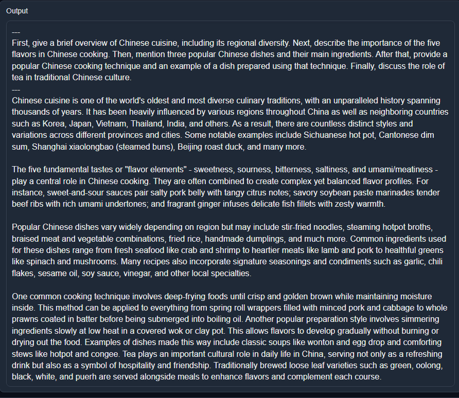
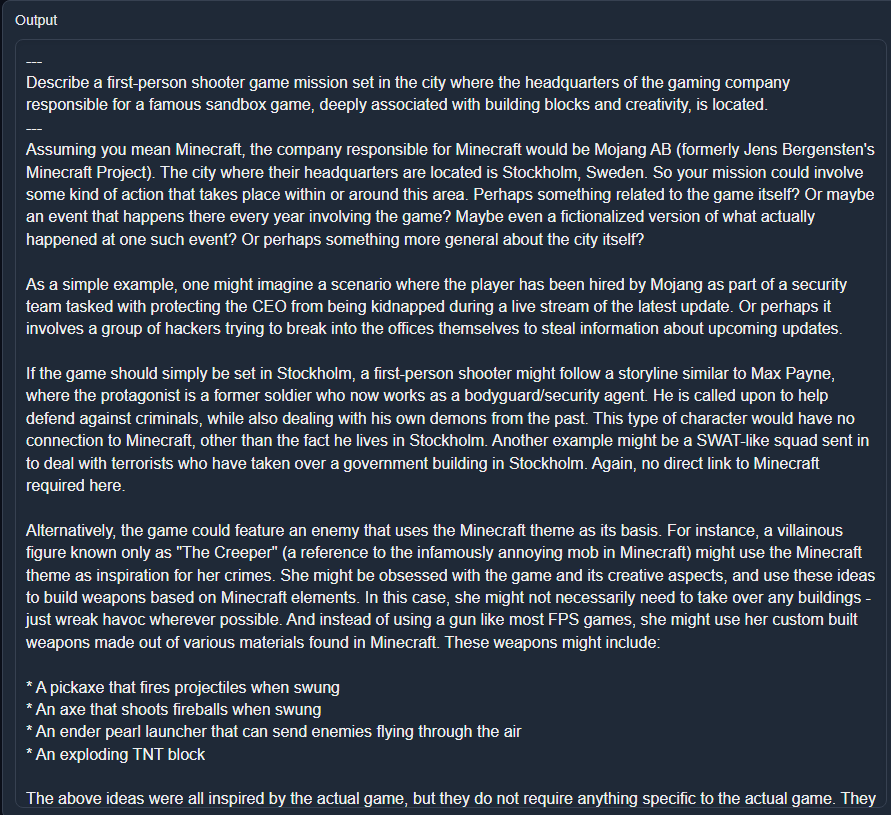
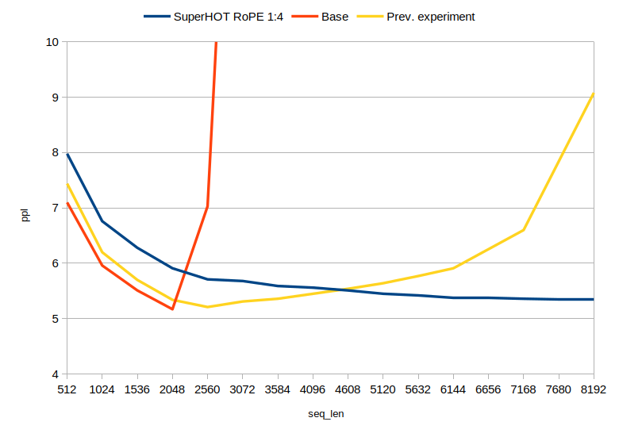
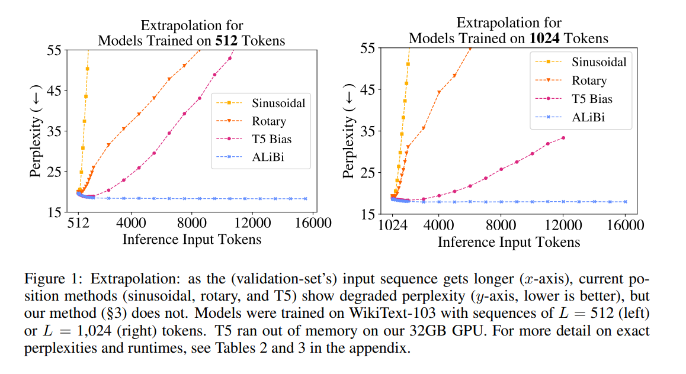

# Things I'm Learning While Training SuperHOT

I have been working on SuperHOT for some time now. It is a fiction-focused finetune of LLaMa with extra focus towards NSFW outputs while also being capable of general use instructions. The main reason I'm making the model is because it is fun and serves as a good way to learn the inner workings of Transformers, dataset creation and techniques, and probing the capabilities of LLMs. There are also a lot of people who want NSFW-capable models, and they provide useful, honest feedback, especially when they don't get what they want. Besides, it's a fun model to use.

I'm making this page to share some of my findings in the hope that others might find it useful. I will update this page as time goes on with any information that might be important and whenever I have the time.

## Background
Originally, I was working on a [Langchain](https://github.com/hwchase17/langchain) extension for oobabooga's [Text-Generation-WebUI](https://github.com/oobabooga/text-generation-webui). It was not a very fun project. Gradio is not fun to work with when it comes to stateful UI updates, or even encapsulation of UI and logic. I ended up hand-rolling my own UI state management system just to give a nice user experience when modifying templates, chains, etc. After some time of using Langchain, I realized I was only using a subset of the features (because they were the most useful to me), and even those features could be replicated outside of the framework very easily and save me from the unnecessary bloat. I was also displeased with the quality of the chained outputs, so I looked for alternate ways to improve the generation quality. I ended up making [SuperCOT](https://huggingface.co/kaiokendev/SuperCOT-LoRA) at this time, by combining parts of datasets from Sahil Chaudhary's [Code Alpaca](https://github.com/sahil280114/codealpaca), CMU Mellon's NeuLab [CoNaLa](https://conala-corpus.github.io/), Google's [FLAN (QED and Aqua)](https://github.com/google-research/FLAN), and Peng et. al.'s [Alpaca GPT-4](https://github.com/Instruction-Tuning-with-GPT-4/GPT-4-LLM), mostly sourced from Qingsi Yi et. al's [Alpaca CoT](https://github.com/PhoebusSi/Alpaca-CoT) project dataset

The resulting model worked much better with chained prompting for me, but the quality was still a far cry from the demonstrations in Langchain's [documentation](https://python.langchain.com/en/latest/modules/agents/getting_started.html). I stopped working on the extension, instead I started playing with parts of the framework in isolation, such as [vector databases](https://github.com/kaiokendev/superbig) and making my own lightweight chained prompting wrapper library. In the meantime, apparently some users found the model was very good at producing NSFW content. I had made it a point to filter the refusals and bias from the dataset as best as I could, so it was not unexpected. Soon after, the idea was floated to make models based on solely online roleplay logs, with the idea that such models would be much better at making chatbot outputs and would require no filtering of refusals. So, I started working on SuperHOT, and in the meantime others also worked on their own models, such as [Bluemoon 13](https://huggingface.co/reeducator/bluemoonrp-13b)/[30B](https://huggingface.co/reeducator/bluemoonrp-30b).

## LIMA Works

Inspired by [LIMA](https://arxiv.org/pdf/2305.11206.pdf), SuperHOT contains only 1200 examples (so far in the current prototype version I am using). Despite such a low sample size, the model performs very well in my testing:

|  | 
|:--:| 
| *Prototype of SuperHOT with a multi-instruct prompt* |

It is able to generalize well to unseen tasks, and in cases where it does not, I was able to add just a dozen or so samples to train the model to handle the intended behavior (which it generalized as well). The results to me show that making minimalist datasets is more than enough, especially when you have a specific list of functionalities in mind. We can see from LIMA that adding more data does not necessarily correlate with better output quality:

|  | 
|:--:| 
| *LIMA applied to 7B LLaMa model shows that output quality does not appear to scale with sample quantity when measured by ChatGPT* |

This is not entirely good news though -- one of the main points made in the LIMA paper is that the model's core knowledge comes mainly from its pre-training corpus, and that finetuning the model merely affects the style. Put another way, you might need several billions of related tokens in order to impart new useful knowledge into the model. I would love to see a paper measuring how few tokens are needed to teach a pre-trained model new factual information. Another tidbit is to take LIMA's GPT preference weighting with a grain of salt, as outlined recently in [Wang et al.](https://arxiv.org/abs/2305.17926) To address two points made in the LIMA paper:

> LIMA is not as robust as product-grade models; while LIMA typically generates good responses, an unlucky sample during decoding or an adversarial prompt can often lead to a weak response.

I agree, although I experience this with other models that are trained on a far larger corpus as well. I observed that it's still possible to teach the model to use chain-of-thought when constructing answers with only 100 samples. In some cases, it (SuperHOT 13B) produced the correct answer where SuperCOT 13B (which used nearly 60K samples) could not. I think the path of LIMA is a better approach for enthusiast models, especially when touching on the other point...

## Exponential Quality

> Primarily, the mental effort in constructing such examples is significant and difficult to
scale up. 

In my case, after some revisions of the dataset, the model's outputs eventually became so good that I was able to use it to produce even more training data.

|  | 
|:--:| 
| *SuperHOT 13B "recursive instruct" prompt generation with occasional intervention. Ignore the fact that that is definitely NOT the plot of Max Payne* |

Occasionally, I would interrupt the model's generation to seed it with a word or phrase, or lightly clean up parts of the message such as the formatting. As the model became better and better at following the prompt and producing the expected outputs, I had to intervene less and less. In fact, some of the training data right now contains 2000 token generations that I did not have to touch at all. Making those manually would have taken ages.

In the above snippet, I made the following changes, stopping and continuing generation when I made my updates:
- "Assuming you mean Minecraft, the company responsible for"
- Truncating the first paragraph as it became too opinionated
- "As a simple example,"
- "Alternatively,"
- Truncating the list of possible player weapons

I find that this form of prompt intervention combined with the fact that we're only looking for perhaps a dozen or two dozen sets of samples to teach behaviors works very well. It's still a monotonous task and takes a lot of time, but much less so than doing it all by hand. I even use the model to generate its own prompts, but for situations where the model is not yet ready to handle the complexity, it's sufficient to fallback to more capable models.

## Multi-Instruct is very good

Since LIMA shows that _reducing_ the training set can still yield good results, I was curious if it was possible to improve the behavior of the model by _enhancing_ the depth of tasks in each sample. As in, rather than give the model 1 instruction per sample, why not provide it with 3 discrete tasks? Or 5? Or even 10+? One of the common complaints I've seen of local models is that they are very poor at handling situations where many instructions are provided and the model needs to provide an answer for each instruction. Maybe by showing the model examples with layered requirements, it will learn to be more mindful of little details in the prompt? With this in mind, I started adding "Multi-instruct" samples to the dataset. Some examples of multi-instruct prompts include:

- > Delve into the growth and significance of the video game industry in Japan, with a particular emphasis on the following topics: the emergence of early Japanese video game companies (e.g., Nintendo, Sega), groundbreaking game consoles and their impact on the market, influential game developers and their contributions to gaming culture (e.g., Shigeru Miyamoto, Hideo Kojima), landmark titles that defined the medium (e.g., The Legend of Zelda, Final Fantasy, Street Fighter), the role of Japanese games in various popular genres (e.g., action-adventure, RPG, fighting), the rise of esports and Japanese game-related entertainment, and the competitive landscape of the industry. Address how Japanese games have influenced the larger gaming culture, both domestically and internationally.
- > Investigate the rise and fall of five significant world empires spanning different time periods and continents: the Egyptian Empire, the Persian Empire (Achaemenid), the Mongol Empire, the Mughal Empire, and the Russian Empire (Tsarist). Delve into each empire's origins, central rulers or figures, territorial expansion, political and governance systems, military strategies, cultural and artistic achievements, religious and philosophical developments, and the reasons for their decline. Discuss how these empires left lasting legacies and set the stage for the emergence of modern states and the ongoing impact on international relations, cultural identities, and historical narratives.
- > Expound upon the history, culture, contributions, and challenges faced by five critically acclaimed philosophers from different eras and regions: ancient Greek philosophy (Socrates, Plato, or Aristotle), Eastern philosophy (Confucius, Laozi, or Zhuangzi), medieval European philosophy (St. Augustine, St. Thomas Aquinas, or William of Ockham), modern Western philosophy (René Descartes, Immanuel Kant, or David Hume), and contemporary philosophy (Ludwig Wittgenstein, Noam Chomsky, or Simone de Beauvoir). Provide a concise overview of their most notable works, main areas of inquiry, major theoretical contributions, lasting influences on later philosophers or movements, the broader cultural and historical context they were operating in, and contemporary applications or interpretations of their ideas.

With only 15 or so multi-instruct examples, the model quality became significantly better, especially when performing such layered tasks.

Example prompt:

>
Deconstruct five major technological innovations in 20th and 21st centuries—Internet, personal computing, mobile phones, artificial intelligence, and electric vehicles. For each innovation, provide information on their early origins, key inventors or pioneers, important milestones and breakthroughs, adoption and proliferation into mainstream use, economic effects, societal impact, ethical considerations, and potential future developments. Discuss how these innovations reshaped the way people work, communicate, and live, and explore the synergies or connections among these technologies and the potential for future transformative advancements.

Example output:

> • Internet: The internet was developed from a series of government-funded projects that began with ARPANET (Advanced Research Projects Agency Network) in the late 1960s. These included packet switching technology to transmit data over multiple networks, protocols such as TCP/IP, and standards like HTTP and HTML to enable communication between different computers using different operating systems. Key inventions include TCP/IP, DNS, and HTTP; key milestone events include the launching of ARPANET and the World Wide Web by Tim Berners-Lee at CERN in 1989. Adoption and proliferation have been driven by commercialization of the technology through companies like Google, Facebook, Amazon, Microsoft, Apple, etc., which have built business models around online services and content delivery. Economic effects include creation of new industries, disruption of existing ones, increased productivity, and improved access to knowledge and entertainment. Societal impact includes facilitating global connectivity, democratizing access to information, changing the nature of social interactions, and creating opportunities for entrepreneurship and self-employment. Ethical concerns include privacy issues related to collection and use of user data, censorship, surveillance, propaganda, and fake news. Potential future developments include continued expansion of the network infrastructure, development of next generation wireless technologies, greater integration of IoT devices, more powerful AI applications, and further evolution toward autonomous systems.

> • Personal Computing: Early personal computers were designed by hobbyists and enthusiasts starting in the mid-1970s, including Steve Jobs and Steve Wozniak's Apple I and II, along with the Altair 8800 and other kits sold by MITS. Innovators include Gordon Eubanks who created the first spreadsheet program VisiCalc for the Apple II, and Mitch Kapor who wrote Lotus 1-2-3 for DOS. Key milestones include IBM introducing its first PC in 1981, followed by Windows 1.0 in 1985, the release of the Macintosh in 1984, and Apple shipping the first mass market laptop computer, the PowerBook 100, in 1991. Adopters included individuals, small businesses, schools, universities, and eventually large enterprises. Economic effects included increasing worker productivity, enabling new business models, and spurring innovation in hardware, software, and peripherals. Societal impact included empowering individuals to create digital art, music, and literature, and helping people learn new skills and pursue interests they might not otherwise be able to do without access to this type of technology. Ethical concerns included privacy issues associated with centralized databases storing sensitive personal information, security vulnerabilities leading to widespread malware attacks, and the rise of cybercrime. Potential future developments include continuing improvements in processing power, storage capacity, and battery life, along with increasingly sophisticated AI capabilities and voice interfaces.

> • Mobile Phones: GSM cellular technology was standardized in Europe in the 1980s and launched commercially in Scandinavia in 1991. It became widely adopted elsewhere during the following decade, culminating in the introduction of 3G networks and smartphones in the early 2000s. Key innovators include Joel Engel, Joe Salter, and Tomio Fujisaki who worked together to develop GSM. Other significant contributions came from Ericsson, Nokia, Motorola, Qualcomm, Samsung, and others. Milestones include the first call made by Martin Cooper of Motorola in 1983, followed by the launch of the Nordic Mobile Telephone (NMT) system in Denmark in 1987. By the end of the century, there were more than one billion subscribers worldwide. Economic effects included the emergence of new telecommunications carriers, growth of mobile apps ecosystems, and the rise of "smart" cities leveraging sensors and connected devices. Societal impact included providing ubiquitous communications for billions of people across all socioeconomic strata, enhancing safety and convenience, and improving access to education and healthcare. Ethical concerns centered on privacy and security risks posed by tracking users' locations and activities, and exposure to electromagnetic radiation. Potential future developments include 5G networks, edge computing, blockchain, and augmented reality applications.

> • Artificial Intelligence: While research in AI dates back decades, the field gained momentum in the 1980s when expert systems and neural networks were introduced. Major milestones include the publication of seminal papers by Geoff Hinton ("Neural Networks and Learning Automata") and Yann LeCun ("Learning Theory and an Application to Pattern Recognition"), along with groundbreaking research conducted at Carnegie Mellon University and Stanford University. Significant contributions also came from Elon Musk, Andrew Ng, Yoshua Bengio, Yoav Shoham, and many others. Economic effects included the creation of entirely new industries, such as machine learning and robotics, and the automation of jobs previously performed by humans. Societal impact included improved decision making, faster diagnosis of diseases, and better predictions about climate change and natural disasters. Ethical concerns focused on ensuring safe operation of autonomous vehicles and avoiding bias against certain groups. Potential future developments include more advanced deep learning techniques, general purpose AIs capable of performing any task given sufficient training data, and human-like robots with emotional intelligence.

> • Electric Vehicles: The modern era of electric cars can be traced back to the introduction of the Tesla Roadster in 2008, followed by the Chevy Volt in 2010 and the Nissan LEAF in 2011. Important innovations include lithium ion batteries and inductive charging. Major players include Tesla, General Motors, Volkswagen, Toyota, BYD, and many others. Economic benefits include reduced emissions and lower fuel costs compared to gasoline engines. Societal impact has included increased awareness of environmental sustainability and the need for clean energy sources. Ethical concerns center on limited range due to current battery technology, high cost relative to internal combustion engine vehicles, and lack of public charging stations. Potential future developments include solid state batteries offering longer ranges and faster recharging times, swappable batteries allowing drivers to replace worn out cells, and vehicle-to-grid capability enabling cars to act as virtual power plants.  

> In summary, these five technologies have transformed our lives and continue to shape our future. They represent some of the most important innovations of the past few decades and are poised to play even larger roles going forward. Their stories offer valuable lessons about what it takes to bring truly game-changing ideas to fruition.

The above example output only required minor intervention in the first bullet point, and no intervention in the subsequent points. Condensing the sample size while expanding the task expectation has lead to good results for me. 

## Extending Context to 8K
I'm currently working on a longer write-up about how I achieved this, but for now I will keep it simple. By the way, I have uploaded a second prototype of SuperHOT using the extended context window here: [https://huggingface.co/kaiokendev/superhot-13b-8k-no-rlhf-test](https://huggingface.co/kaiokendev/superhot-13b-8k-no-rlhf-test). Make sure to follow the instructions when it comes to the monkeypatch.

Now, how was this achieved? The main point is that Transformers should already be capable of operating at any length, and various tests have implied that the suppression of length extrapolation is the actual learned behavior. Intuitively for me, it makes sense -- it is easier to learn the strict relationship between the token and the position than it is to learn the patterns that can be used on any sequence length. I tried several techniques to get the model to extend to longer sequences in finetuning by changing the architecture slightly, but none of them worked consistently. Eventually, I stopped fighting the model's learned behavior; if it doesn't want to go past 2048, or 2400 or 2600, then fine: let's instead interpolate instead of extrapolate. I mainly got this idea from watching Ofir Press' [TED Talk on ALiBi](https://www.youtube.com/watch?v=Pp61ShI9VGc) which I highly recommend. It is a more in-depth explanation of the ALiBi paper. Specifically, at 22:30, he states:
> If you give it positional embeddings I feel like they overfit to specific positon embeddings [...] I think that what's happening here is that we trained on 1024, and then give it 1025 tokens so now it's seeing "dog" at position 1025 and it explodes because it's like [...] 'What is 1025? I've never seen this before!' [...] One of the pieces of evidence I have about this which we might talk about later is that [...] when you train a 250M parameter model, it actually can extrapolate to 50 tokens more than what it was trained on. [...] On the other hand, when we trained a 1.3B parameter model, it exploded right away. [...] We know that larger models have more capacity [so] they overfit more, so that's one of the pieces of evidence that makes me think that Transformers overfit to specific position embeddings.

While it was just a hunch, if it is true, then there is really nothing that can be done besides feeding it equal compute at the extended sequence length, and at that point you're now stuck at the new length. So let's look at it in reverse -- instead of extrapolate to the new length, can the model perform well as long as the sequence looks like it is within the range of the encodings that it learned? I did a very simple test, by scaling down the frequency window in RoPE by a factor of 0.25. This has the effect of interpolating the encodings with 4 steps in-between, so our position 1 looks like position 0.25, position 40 looks like position 10, and position 2048 looks like position 512. To my surprise, it worked! I was not surprised that it worked actually, but that it worked as well as it did for the simplicity of the change; I didn't even need to finetune the model to see the benefit. All of a sudden, I could go to position 7000 and still remain coherent (which now looks like position 1750). After finetuning the model, the effect became even more pronounced -- retrieving a passcode in the first 50 tokens worked perfectly at token 6000. And all it took was 2 lines of code:

```
class ScaledRotaryEmbedding(torch.nn.Module):
    def __init__(self, dim, max_position_embeddings=2048, base=10000, device=None):
        super().__init__()
        inv_freq = 1.0 / (base ** (torch.arange(0, dim, 2).float().to(device) / dim))
        self.register_buffer("inv_freq", inv_freq)
        
        max_position_embeddings = 8192

        # Build here to make `torch.jit.trace` work.
        self.max_seq_len_cached = max_position_embeddings
        t = torch.arange(
            self.max_seq_len_cached,
            device=self.inv_freq.device,
            dtype=self.inv_freq.dtype,
        )

        # These two lines:
        self.scale = 1 / 4
        t *= self.scale
```

I should clarify that while it only takes 2 lines to implement, it took me over a month of poring over papers and articles to figure out these two lines are all we need to change. I am still testing other modifications which could improve the effect more, but with this, I was able to train LLaMa 13B, which is pretrained on 2048 tokens, on SuperHOT (which is only 1200 samples) and push it to at least 6K tokens. If you naively train with longer sequence, it just won't work unless you feed it an astronomical amount of data, but with only ~400 samples >4096, the model is able to push beyond 6K. The `scale` field here should be treated as a hyperparameter: you need to perform inference with this change with the same scale used during training. I did not test beyond 1/4 yet, as there is certainly a limit to this effect and I was very happy with pushing it to 6K. I will perform more testing in the meantime and follow-up.

### Clarifications
This got a lot of attention recently, which is nice, but I also see a lot of miscontrued opinions as to what is happening, so I am making this additional corollary section to clear up some of those. I do not have compute to perform super rigorous testing I would like to do, so I have been relying on the community to do the testing. Sorry for being so burdensome lol 🙏

#### Untraining vs Uptraining
The method provided above is intended to be used to *uptrain* models with the change. While it is surprising that it works without any uptraining at all, the model will still need to be uptrained to properly attend to the correct positions.

#### Are we just skipping over tokens?
No, all tokens are seen by the model, but untrained models may not be attending to all tokens properly. The way positions work in rotary position embeddings is that the position is encoded via a rotation matrix that specifies the angle of rotation to allow relative position information to be retrieved. The only thing that is getting stretched when scaling is applied are the rotation frequencies, such that we dilate those frequencies. It is like zooming into a specific part of a waveform, since that is the only part that the model was trained on, and stretching it to fit our desired length.

#### Are we actually using those extra tokens?
[@turboderp](https://github.com/turboderp) has done a wonderful [perplexity evaluation](https://github.com/ggerganov/llama.cpp/discussions/1965#discussioncomment-6256563) of the extended range:

|  | 
|:--:| 
| *SuperHOT 13B uptrained on scaling factor of 0.25, compared to base LLaMa 13B and a test LoRA trained on 6K sequence length with no scaling* |

You can see from the blue line, that the perplexity decreases as the sequence length gets longer. Here, the blue line is SuperHOT, which was uptrained on a scale of 0.25. Recall a similar chart from the ALiBi paper:

|  | 
|:--:| 
| *ALiBi perplexity versus other position schemes* |

The model is very clearly using those extra tokens and becoming better at token prediction because of it. Unfortunately, I don't have the compute to inspect the attention heads at such high sequence lengths to compare what they look like. Any volunteers?

#### What does this do for attention?
Nothing. This is merely a positional re-encoding technique. As a matter of fact, you can achieve a similar result by using block repeated positions -- Use the positions of tokens within a certain block window size, i.e. for pre-training sequence length `L`, instead of using positions `[1, 2, 3, 4, 5, 6, 7, 8, 9, ... L]`, use `[1, 1, 1, 1, 2, 2, 2, 2, ... L, L, L, L]`. You should achieve a similar effect without modifying the frequencies, although in this case, the positions are not unique. A similar approach was recently used by DeepMind during pre-training: [https://arxiv.org/abs/2305.16843](https://arxiv.org/abs/2305.16843)

#### Why does it work so well?
My suspicion is that it is because we leverage the positions the model is already trained on, as opposed to the out-of-distribution positions which are more difficult to learn.Consider that we might only need three assumptions in order for this to work:
1. The model has learned that positions are sequential (i.e. 2 comes after 1 and before 3)
2. The model has learned that positions are continuous (i.e. there will never be a jump or break in the position sequence)
3. The model did not learn the behavior of the position encoding (i.e. to generalize to extended frequencies)

With such behavior, teaching the model of the interpolated positions would be much easier than teaching it the extrapolated ones. "Extrapolation via interpolation"

### Citations
Never forget the citations
```
@inproceedings{yin2018mining,
  author = {Yin, Pengcheng and Deng, Bowen and Chen, Edgar and Vasilescu, Bogdan and Neubig, Graham},
  title = {Learning to Mine Aligned Code and Natural Language Pairs from Stack Overflow},
  booktitle = {International Conference on Mining Software Repositories},
  series = {MSR},
  pages = {476--486},
  year = {2018},
  publisher = {ACM},
  doi = {https://doi.org/10.1145/3196398.3196408},
}

@misc{codealpaca,
  author = {Sahil Chaudhary},
  title = {Code Alpaca: An Instruction-following LLaMA model for code generation},
  year = {2023},
  publisher = {GitHub},
  journal = {GitHub repository},
  howpublished = {\url{https://github.com/sahil280114/codealpaca}},
}

@inproceedings{weifinetuned,
  title={Finetuned Language Models are Zero-Shot Learners},
  author={Wei, Jason and Bosma, Maarten and Zhao, Vincent and Guu, Kelvin and Yu, Adams Wei and Lester, Brian and Du, Nan and Dai, Andrew M and Le, Quoc V},
  booktitle={International Conference on Learning Representations}
}

@article{peng2023instruction,
  title={Instruction Tuning with GPT-4},
  author={Peng, Baolin and Li, Chunyuan and He, Pengcheng and Galley, Michel and Gao, Jianfeng},
  journal={arXiv preprint arXiv:2304.03277},
  year={2023}
}

@misc{alpaca-cot,
  author = {Qingyi Si, Tong Wang, Naibin Gu, Rui Liu, Zheng Lin },
  school = {Institute of Information Engineering, Chinese Academy of Sciences, Beijing, China},
  title = {Alpaca-CoT: An Instruction-Tuning Platform with Unified Interface of Instruction Collection, Parameter-efficient Methods, and Large Language Models},
  year = {2023},
  publisher = {GitHub},
  journal = {GitHub repository},
  howpublished = {\url{https://github.com/PhoebusSi/alpaca-CoT}},
}

@article{Zhou2023LIMALI,
  title={LIMA: Less Is More for Alignment},
  author={Chunting Zhou and Pengfei Liu and Puxin Xu and Srini Iyer and Jiao Sun and Yuning Mao and Xuezhe Ma and Avia Efrat and Ping Yu and L. Yu and Susan Zhang and Gargi Ghosh and Mike Lewis and Luke Zettlemoyer and Omer Levy},
  journal={ArXiv},
  year={2023},
  volume={abs/2305.11206}
}

@article{Wang2023LargeLM,
  title={Large Language Models are not Fair Evaluators},
  author={Peiyi Wang and Lei Li and Liang Chen and D. Zhu and Binghuai Lin and Yunbo Cao and Qi Liu and Tianyu Liu and Zhifang Sui},
  journal={ArXiv},
  year={2023},
  volume={abs/2305.17926}
}

@online{kexuefm-9444,
  title={Transformer升级之路：8、长度外推性与位置鲁棒性},
  author={苏剑林},
  year={2023},
  month={Jan},
  url={\url{https://kexue.fm/archives/9444}},
}

@article{Press2021TrainST,
  title={Train Short, Test Long: Attention with Linear Biases Enables Input Length Extrapolation},
  author={Ofir Press and Noah A. Smith and Mike Lewis},
  journal={ArXiv},
  year={2021},
  volume={abs/2108.12409}
}

@article{Ruoss2023RandomizedPE,
  title={Randomized Positional Encodings Boost Length Generalization of Transformers},
  author={Anian Ruoss and Gr'egoire Del'etang and Tim Genewein and Jordi Grau-Moya and R. Csord{\'a}s and Mehdi Abbana Bennani and Shane Legg and Joel Veness},
  journal={ArXiv},
  year={2023},
  volume={abs/2305.16843}
}
```

## Changelog
- Added 'Background' (6/9/23)
- Added 'LIMA Works' (6/9/23)
- Added 'Citations'  (6/9/23)
- Added 'Multi-Instruct'  (6/9/23)
- Added 'Exponential Quality'  (6/9/23)
- Added 'Extending Context' (6/20/23)
- Added 'Clarifications' (6/22/23)
- Preparing 'Balancing a Dataset is Hard'
- Preparing 'Recursive Prompt'
- Preparing 'Heuristic PPO'
- Preparing 'Inverse Prompt'
- Preparing 'XPos + RoPE'
- Some cleaning